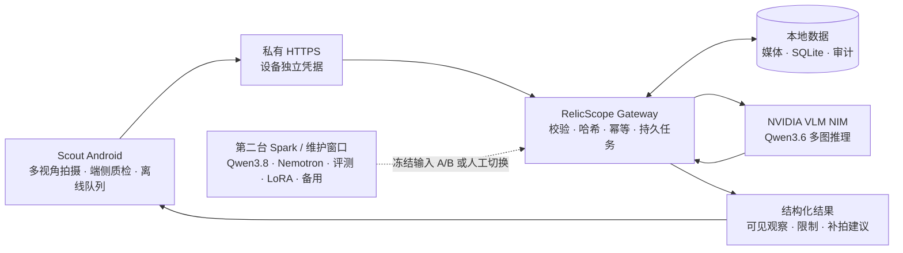

# RelicScope AI

### 以 NVIDIA DGX Spark 与 NIM 为本地 AI 核心的艺术品科学鉴证平台

RelicScope AI 将现场采集、本地多模态 AI、证据组织和可追溯结果连接成一套可部署的系统。第一阶段聚焦古陶瓷：Scout 安卓手持设备负责规范拍摄和端侧质量检查，NVIDIA DGX Spark 负责私有存储、本地模型推理、持久任务与结构化结果。

项目的目标，是让每次观察都能回到原始对象、采集视角、模型版本和运行记录，并为后续专家复核、参考样本检索及科学仪器检测保留一致的数据接口。

> **当前版本：V2 工程基线。** 核心软件已完成本地自动化验证；客户的 DGX Spark、目标 Android 设备、正式网络和授权样本仍须现场验收。仓库不宣称仅凭 RGB 图片判断真伪、年代、窑口、作者或价值，也不使用开发电脑结果代替 Spark 实测。

## 一页读懂项目

| 维度 | 当前交付 | 长期方向 |
|---|---|---|
| 产品入口 | Android Scout 参考客户端代码：多视角拍摄、质检、断网队列、安全上传与结果查看；目标手机待验收 | 面向机构的采集设备、审批与协作体系 |
| 本地计算 | 单台 DGX Spark 的接入、存储、排队、VLM 推理与结果返回拓扑和部署脚本已形成；目标机器待验收 | 第二台 Spark 承担候选模型、评测、微调、批处理或人工切换备用 |
| AI 能力 | 多图请求、受约束结构化观察和服务端结果校验已实现；真实 NIM 输出待 Spark 实测 | 经授权数据验证的检索、领域模型、视频理解和受限 Agent |
| 科学体系 | 原始哈希、输入顺序、模型身份、请求证明和审计字段已进入代码；仪器结果仍为演示回放 | Scientific Evidence Graph、Vault V1、Raman/XRF/HSI/RTI/3D 等仪器适配 |
| 数据责任 | 保存任务所需媒体、元数据和结果；真实资料始终留在私有目录 | Gold Dataset、Counterfeit Corpus 与机构知识包须由权属和专家流程共同建设 |

## 为什么这个系统有价值

- **现场流程可复制。** Scout 把拍摄视角、图像质量、断网恢复和任务身份固化为协议，降低输入差异。
- **敏感资料留在本地。** 图片、任务、知识包和模型服务可以在 Spark 内网运行，模型端口不对外暴露。
- **AI 输出可复核。** 结果绑定原始文件哈希、capture ID、模型制品身份（NIM profile 或模型 revision）、容器 digest、请求/输出哈希与延迟，不把一段生成文字当成无来源的结论。
- **系统可以逐层升级。** 参考库、领域微调、视频模型、Agent 和科学仪器是可插拔能力；基础流程不依赖它们才能启动。
- **专家保留最终解释权。** 软件组织观察、冲突、不确定性与下一步，不越过艺术史、材料科学和法定鉴定的专业边界。

## 产品体系与长期价值

| 层级 | 现在解决什么 | 长期积累什么 |
|---|---|---|
| **RelicScope Scout** | 把多角度拍摄、质量检查、断网续传和任务身份变成一致的现场协议 | 可比较、可追溯的第一手采集数据 |
| **RelicScope Spark Core** | 在机构现场完成私有存储、模型推理、任务恢复和结构化观察 | 可替换模型的本地 AI 基础设施与运行证据 |
| **Scientific Evidence Layer** | 用统一字段表达来源、校准、观察、限制、冲突和拒绝判断 | 跨模型、跨仪器、跨时间可复核的证据资产 |
| **Domain & Institution Network** | 当前只预留接口与治理边界 | 经授权的 Gold Dataset、Counterfeit Corpus、机构知识包和协作标准 |

项目价值随着合格数据和复核次数增长：采集协议提高数据一致性，证据结构保留来源和不确定性，本地部署建立机构信任，经过授权与验证的领域资产再推动检索、微调和标准化。每一层都能独立验收，也能在不重做现场主链路的前提下升级。

## 推荐的 V2 部署拓扑（待目标 Spark 验收）



一个标准任务必须能由一台 Spark 完成。两台设备不被永久绑定为固定角色，也不会被描述成自动合并的“256 GB GPU”。第二台可以在不同阶段承担相同主服务备用、模型 A/B、视频实验、批量评测或 LoRA/PEFT；只有业务和实测证明需要时，才评估 ConnectX-7、Ray/NCCL 或分布式推理。

## 当前工程状态

| 模块 | 状态 | 已有证据 / 放行条件 |
|---|---|---|
| Scout V2 API 与任务内核 | **`CODE_VERIFIED`** | 设备认证、多图上传、服务端质量门、内容寻址存储、SQLite 队列、幂等、退避与重启恢复具备自动化测试 |
| 本地 VLM 请求与结果约束 | **`CODE_VERIFIED`** | 单次有序多图请求；JSON schema、capture ID、禁区和模型运行回执由服务端校验 |
| Android Scout 参考客户端 | **`DEPLOYMENT_READY`** | CameraX、Room、WorkManager 与 HTTPS 接口已接通；仍需目标手机、正式证书和后台策略验收 |
| NVIDIA NIM 部署包 | **`DEPLOYMENT_READY`** | 已提供 Spark 专用配置、profile 发现、在线准备、离线预检、健康检查和真实多图 smoke 入口 |
| Qwen3.6 / Qwen3.8 / Nemotron | **待 Spark 实测** | 需记录 1/3/5 图冷/热延迟、峰值统一内存、连续任务、结构化输出和专家盲评 |
| 私有资料导入工具 | **`CODE_VERIFIED`** | 支持只读审计与受控导入；客户图片、PDF、文件名和审计明细不随公开仓库分发，分组与视角仍须人工确认 |
| 参考库与开放集识别 | **独立实验模块** | 现有旧栈提供研究接口，尚未接入 Scout V2 NIM 主链路；没有独立复拍、负例和冻结阈值时必须返回未校准状态 |
| 真伪、断代与估价 | **不在当前自动结论范围** | 需要受控参考、科学测量、专家责任和适用法规共同支持 |

状态词有严格含义：`CODE_VERIFIED` 只说明开发环境中的软件逻辑；`DEPLOYMENT_READY` 只说明安装和验收入口齐备；只有在客户机器保存完整证据后，才可标记为 `HARDWARE_VERIFIED` 或 `PILOT_ACCEPTED`。领域准确率还需独立的 `DOMAIN_VALIDATED` 证据。

## NVIDIA DGX Spark 与模型策略

DGX Spark 在本项目中承担的是**私有 AI appliance**：在现场或机构内保存敏感媒体，运行较大的多模态模型，并为 Scout 提供稳定、可替换的内网服务。128 GB 是 CPU/GPU 共享统一内存，操作系统、模型权重、KV cache、图像预处理和应用共同使用；因此首版默认只常驻一套大模型，并发从 1 开始实测。

当前模型槽位如下：

| 槽位 | 选择 | 理由 | 当前边界 |
|---|---|---|---|
| 生产试运行基线 | **Qwen3.6-35B-A3B + NVIDIA VLM NIM `1.7.1-variant`** | 中文、多图、开放权重；NVIDIA 明确提供 DGX Spark 专用 ARM64 profile | 先关闭 thinking 和视频；实际 profile、容器 digest 与表现必须在目标 Spark 冻结 |
| 中文质量挑战者 | **Qwen3.8-27B FP8** | 更新的原生图像/视频模型，适合验证质量上限 | 当前 NIM 矩阵未单列 Spark 优化 profile，先做顺序 A/B |
| 视频/音频挑战者 | **Nemotron 3 Nano Omni NVFP4** | NVIDIA 原生多模态候选，模型卡列出 DGX Spark | 训练与评测偏英文，不能未经中文领域验证直接晋级 |
| 参考检索插件 | **Qwen3-VL-Embedding-2B** | 支持图文与多视图向量，可做库内同件候选及相关参考 | 默认关闭；需要授权数据、独立复拍、开放集负例和阈值校准 |

模型只负责“可见观察”。认证、输入质量、任务状态、重试、拒绝判断和结论边界由确定性代码控制。完整依据、参数起点和晋级门槛见[模型选型与 Spark 运行栈](docs/MODEL_SELECTION_AND_SPARK_RUNTIME_2026-09.md)。

## 从这里开始

| 读者 | 建议入口 |
|---|---|
| 项目负责人 / 合作机构 | [V2 产品边界与技术规划](docs/V2_SCOUT_SPARK_PRODUCT_SCOPE.md) · [长期开发路线](docs/PRODUCTION_ROADMAP.md) |
| Spark 部署工程师 | [单台 Spark 正式部署](docs/V2_SCOUT_SPARK_DEPLOYMENT.md) · [运行时与 NVIDIA 映射](docs/RUNTIME_BOUNDARY.md) · [现场验收表](docs/V2_SPARK_ACCEPTANCE.md) |
| Android / Scout 工程师 | [Scout Android 参考客户端](scout-android/README.md) |
| 模型工程师 | [模型选型报告](docs/MODEL_SELECTION_AND_SPARK_RUNTIME_2026-09.md) · [第二台 Spark 实验节点](docs/V2_SECOND_SPARK_LAB.md) |
| 数据与领域团队 | [私有测试资料导入](docs/PRIVATE_ARTWORK_TEST_DATA.md) · [参考库独立实验（尚未接入 V2）](docs/REFERENCE_LIBRARY_DEPLOYMENT.md) |
| 安全与运维 | [安全基线](docs/SECURITY_HARDENING.md) · [备份与恢复](docs/V2_BACKUP_RESTORE.md) · [GitHub / Codex / Spark 快速复现](docs/GITHUB_SPARK_QUICKSTART.md) |

## 在开发电脑运行工程预览

工程预览是一个 **FastAPI 服务 + 同源前端**，并非可以双击打开的静态 HTML，也没有部署成 GitHub Pages 网站。直接打开 `app/static/index.html` 或使用仓库的 Website/Open 预览不会获得 API、任务数据库和报告服务。

该预览用于验证图像、视频、证据图与报告 API。仪器数据属于 `DEMO/SYNTHETIC` 回放；它不是 Scout V2 的现场产品界面，也不代表 DGX Spark 或真实仪器已经通过验收。历史界面证据仍保存在 `docs/evidence/`，不作为主页产品截图。

首次运行：

```bash
git clone https://github.com/dingyucanada/relicscope-spark-suite.git
cd relicscope-spark-suite
git switch main
make console-install
```

终端显示服务就绪后，访问：

```text
http://127.0.0.1:8088
```

已经安装过依赖时使用 `make console`。另开终端运行 `make console-smoke`，会验证真实 JPEG/MP4、会话、证据图、审计和报告闭环。工程预览中的内置仪器结果属于明确标记的 `DEMO/SYNTHETIC` 回放；它用于验证未来工作流，不代表 Scout V2 已接入这些仪器。

排障与验收步骤见[本地工程预览运行指南](docs/ENGINEERING_CONSOLE.md)。

## 在一台 DGX Spark 部署主链路

推荐路径为 NVIDIA VLM NIM + Qwen3.6。以下命令必须在目标 Spark 执行；首次准备需要经批准的联网窗口和 NGC Personal API Key，正式运行阶段不把 NGC/Hugging Face 凭据注入容器。

```bash
git clone https://github.com/dingyucanada/relicscope-spark-suite.git
cd relicscope-spark-suite
git switch main

# 1. 创建私有配置、数据目录、证书目录和随机服务密钥；不下载、不启动
make v2-nim-install

# 2. 编辑 .env.v2.nim，填写私有 SCOUT_BIND_IP 与 SCOUT_HOSTNAME
# 3. 在本机发现兼容 profile；脚本使用隔离的临时 Registry 登录并自动清理
make v2-nim-list-profiles \
  NIM_PROFILE_ARGS="--allow-network --ngc-key-file /secure/ngc_api_key"

# 4. 只把选定 ID 写入 NIM_MODEL_PROFILE；准备脚本会同步兼容别名并冻结配置
make v2-nim-prepare-online \
  NIM_PREPARE_ARGS="--ngc-key-file /secure/ngc_api_key"

# 5. 关闭批准的公网下载窗口，执行严格预检并启动
make v2-nim-start
make v2-nim-health
```

随后导出受控试运行 CA、配发一台 Scout 的独立凭据，并用真实多视角图片完成端到端 smoke：

```bash
make v2-nim-export-ca
make v2-nim-enroll \
  SCOUT_NAME="Scout 01" \
  SCOUT_SERVER_URL="https://scout.spark.local:8443" \
  SCOUT_DEVICE_ARGS="--output runtime/provisioning/scout-01.json"

make v2-nim-smoke SCOUT_SMOKE_ARGS="\
  --provisioning runtime/provisioning/scout-01.json \
  --ca-cert runtime/provisioning/scout-local-ca.crt \
  --capture FRONT=/private/test/front.jpg \
  --capture BACK=/private/test/back.jpg \
  --capture BASE=/private/test/base.jpg"
```

正式步骤、配置项、离线边界和交接清单以[单台 Spark 正式部署](docs/V2_SCOUT_SPARK_DEPLOYMENT.md)为准。Codex Desktop 可帮助工程师检出、检查和排障，但不是 RelicScope 的运行依赖。

## 使用私有艺术品资料

客户图片、PDF、专家意见和身份信息不得进入公开 Git。导入分为两步：先只读审计，再写入 Git 已忽略的本机目录。

```bash
make private-artwork-audit \
  PRIVATE_ARTWORK_ARCHIVE=/absolute/path/artworks.zip

make private-artwork-import \
  PRIVATE_ARTWORK_ARCHIVE=/absolute/path/artworks.zip \
  PRIVATE_ARTWORK_BATCH=customer-pilot-001
```

导入器检查路径穿越、符号链接、文件 magic、格式、像素、体积与压缩比；媒体按 SHA-256 保存。目录名只作为 `candidate_group`，视角在人工确认前保持 `unclassified`。PDF 只登记为待人工复核资料，绝不会被当作项目指令。

## 代码与交付结构

```text
app/
  scout_main.py             Scout V2 私有 API 入口
  scout/                    认证、采集、任务、存储、模型编排与结果
  static/                   本地工程预览（需由 FastAPI 提供 API）
scout-android/              Android Scout 参考客户端
deploy/                     初始化、NIM 准备、离线预检、健康与验收
scripts/                    Scout smoke、模型 A/B、数据导入与公开发布检查
docs/                       产品边界、部署、模型、安全、验收和路线图
openspec/                   V2 需求、设计、任务和规范变更记录
compose.v2.nim.yml          推荐：NVIDIA NIM 单 Spark 主链路
compose.v2.yml              备选：DGX Spark 上的 vLLM / 自选模型主链路
compose.v2.lab.yml          可选：第二 Spark 候选模型与评测节点
Makefile                    稳定的工程与运维入口
```

私有运行数据位于 `runtime/` 或环境配置指定的数据卷；模型 cache、`.env*`、密钥、配发文件、客户资料和本地工作目录均由发布检查阻止进入 Git 与 Docker build context。

## 工程质量与复现

在提交或交接前运行：

```bash
make console-check
make test
make check
python3 scripts/check-public-release.py
```

目标 Spark 还必须执行 NIM 预检、真实多图 smoke 和[V2 现场验收表](docs/V2_SPARK_ACCEPTANCE.md)。验收记录至少包含源码 commit、DGX OS、driver/CUDA、镜像 digest、NIM profile、served model、输入哈希、1/3/5 图冷/热延迟、峰值统一内存、失败与恢复行为。

## 路线图

1. **单机闭环。** 在第一台 Spark 和目标 Scout 上冻结运行栈，完成连续任务、断网、重启、低磁盘与设备撤销验收。
2. **模型基线。** 用授权陶瓷样本对 Qwen3.6、Qwen3.8 和 Nemotron 做冻结输入 A/B，建立可见事实、遗漏、越界、延迟和内存基线。
3. **双机弹性。** 根据客户优先级，把第二台 Spark 配置为同版本备用或独立模型/评测节点，再验证人工切换与恢复时间。
4. **领域能力。** 在数据权属、标注规范和专家流程成立后，选择参考检索、LoRA、视频理解、知识包或受限 Agent 中最有价值的一项上线。
5. **科学扩展。** 以统一证据结构接入 Vault V1 和合格实验室的 Raman、XRF、HSI、RTI、3D、X-ray/CT/TL 结果，逐步形成跨机构可复核的科学鉴证网络。

## 科学、安全与知识产权边界

- RGB 图片可以支持可见特征记录、采集质量检查和相关性分析，不能独立证明真伪、绝对年代、窑口、作者或价值。
- 相似度是候选排序信号，不是概率、证书或专家结论；样本库缺失时系统必须允许拒绝判断。
- 任何未来仪器结果都必须携带原始数据、校准、区域、设备、操作和版本信息；软件不得虚构测量值。
- Scout 仅通过私有 HTTPS 接入；模型和管理端口不向公网暴露；每台设备使用可撤销的独立凭据。
- 本仓库公开可见不等于开放授权。除非另有书面许可，版权和相关权利均保留，详见 [NOTICE](NOTICE.md) 与 [Third-Party Notices](THIRD_PARTY_NOTICES.md)。

---

**RelicScope AI** — 把现场观察转化为本地运行、可追溯、可复核的科学证据流程。
